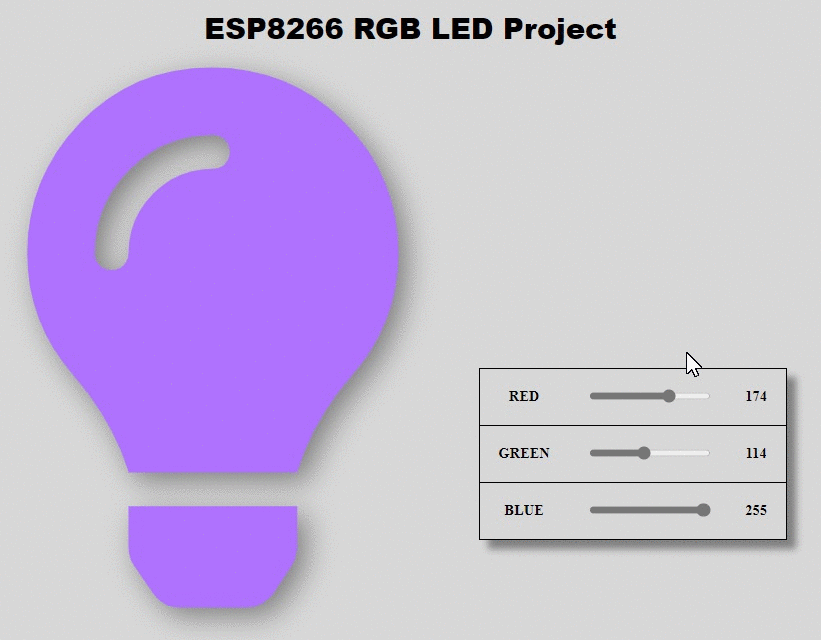

# NodeMCU-RGB-LED
Light up a RGB LED using ESP8266 module with RGB sliders on a web server (using AJAX).

## Web Layout

## Live Functioning
YouTube video will be uploaded  soon !!

## Components Required
<li>ESP8266 Module</li>
<li>RGB LED(common anode)</li>
<li>1k ohm resistor (3)</li>
<li>Jumper Wires(5)</li>

## Circuit Layout

I have a common anode RGB LED, therefore the common lead must be connected to the 3.3V present on the board. The red, green and blue leads are connected, through three 1k-Ω resistances, to the  D1 (GPIO5 ), D2 (GPIO4) and D3 (GPIO0) pins, respectively. The diagram is shown below.

## Code
### Web Layout
It includes all the frontend part of the project (HTML, CSS, JS) and keeps the webpage updated without refreshing (using AJAX). [Click Here](esp8266Code/index.h) to view the code.
### Backend Part
All the backend functioning of project i.e. controlling the LED from the webpage. To view its code [Click Here](esp8266Code/main.ino).
